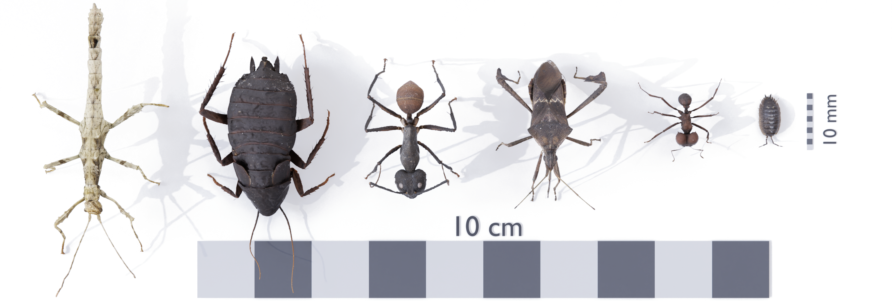
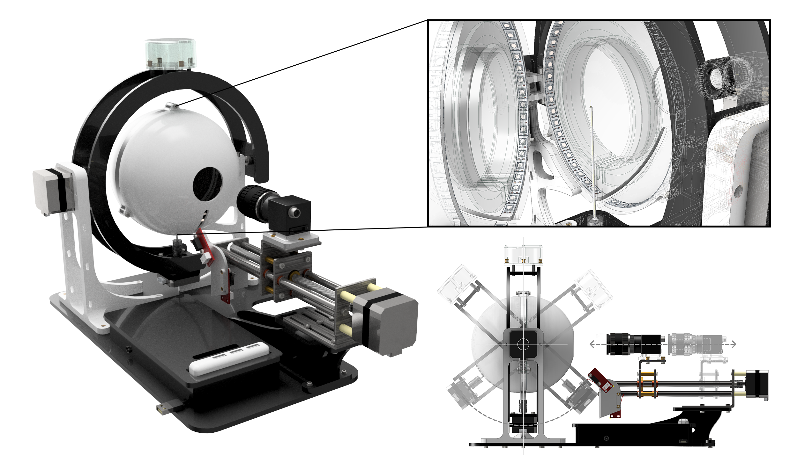
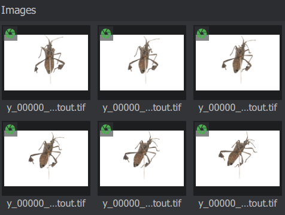

# scAnt - Open Source 3D Scanner

**scAnt** is an open-source, low-cost macro 3D scanner, designed to automate the creation of digital 3D models of insects of various sizes in full colour. **scAnt** provides example configurations for the scanning process, as well as scripts for stacking and masking of images to prepare them for the photogrammetry software of your choice. Some models generated with **scAnt** can be found on http://bit.ly/ScAnt-3D as well as on our [Sketchfab Collection](https://sketchfab.com/EvoBiomech/collections/scant-collection)!



All structural components of the scanner can be manufactured using 3D-printing and laser cutting; the required files are available for download in .ipt, .iam, .stl, and .svg format on our [thingiverse](https://www.thingiverse.com/fabianplum/designs) page.



## Installation
**scAnt** is supported by 64 bit versions of **Windows 10** and **Ubuntu 18.04** (newer releases of Ubuntu will likely work but have not been tested). The pipeline and GUI have been designed specifically for use with [FLIR Blackfly](https://www.flir.co.uk/products/blackfly-s-usb3/) cameras, and [Pololu USB Stepper drivers](https://www.pololu.com/category/212/tic-stepper-motor-controllers). Adding support for other cameras is not overly demanding, and we plan to do so in the future if the demand is high. Please refer to our [thingiverse](https://www.thingiverse.com/fabianplum/designs) page for a full list of components.

The easiest way to get your scanner up and running is through installation of our pre-configured anaconda environment:

**for Ubuntu 18.04**

```bash
cd conda_environment
conda env create -f scAnt_UBUNTU.yml
```

**for Windows 10**

```bash
cd conda_environment
conda env create -f scAnt_WINDOWS.yml
```

After the environment has been created successfully, re-start the terminal, and run the following line to activate the environment, and to continue the installation.

 ```bash
conda activate scAnt
```

If you do not wish to install the pre-configured environment, here are the dependencies:

  - python >= 3.6
  - pip
  - numpy
  - matplotlib
  - opencv >= 4.1.0
  - pyqt 5
  - imutils
  - pillow
  - scikit-image


Additional drivers and libraries for the camera and stepper drivers need to be installed, as described for both Ubuntu and Windows below.
***

### Ubuntu 18.04

Download the drivers and python bindings for **Spinnaker & Pyspin** from the official FLIR page:

[meta.box.lenovo.com](https://meta.box.lenovo.com/v/link/view/a1995795ffba47dbbe45771477319cc3)


**FLIR Support / Spinnaker / Linux Ubuntu / Ubuntu 18.04**

*download the tar.gz file for your architecture (usually amd64)*

**FLIR Support / Spinnaker / Linux Ubuntu / Python / Ubuntu 18.04 / x64**

*depending on your python version, download the respective file. For our conda environment download **...cp37-cp37m_linux_x86_64.tar.gz***


Unpack all files in a folder of your choice. Then proceed with the following steps:

1. Install all required dependencies

```bash
sudo apt-get install libavcodec57 libavformat57 libswscale4 libswresample2 libavutil55 libusb-1.0-0 libgtkmm-2.4-dev
```

2. Install spinnaker from its extracted folder. During installation, ensure to add your user to the user-group and accept increasing allocated USB-FS memory size to 1000 MB in order to increase the video stream buffer size

```bash
sudo sh install_spinnaker.sh
```

3. **Reboot** your computer

4. Launch spinview and connect your FLIR camera to verify your installation (if the application is already launched when plugging in your camera, refresh the list)

5. Next, install the downloaded **.whl** file for your python environment. Ensure you activate your python environment before running the **pip install** command below.

```bash
pip install spinnaker_python-1.x.x.x-cp37-cp37m-linux_x86_64.whl
```

6. To verify everything has been installed correctly, run **Live_view_FLIR.py** from the GUI folder. 

```bash
cd scant/GUI
python Live_view_FLIR.py
```

If a live preview of the camera appears for a few seconds and an example image is saved (within the GUI folder), all camera drivers and libraries have been installed correctly.

**Stepper driver setup**

1. The Pololu stepper drivers can be controlled and set up via a console. Download the drivers specific to your system from [pololu.com](https://www.pololu.com/docs/0J71/3.2), which also provides additional information regarding installation and a list of supported commands. All drivers are open-source, and the respective code can be found on [Pololu's Git](https://github.com/pololu/pololu-tic-software).

2. Unpack the downloaded .tar.xy file and install the driver:

```bash
sudo pololu-tic-*/install.sh
```

3. Next, **reboot** your computer to update your user privileges automatically, otherwise you will have to use **sudo** to access your USB stepper drivers.

4. If one or all of the stepper controllers were previously plugged into your computer re-plug them, so they are recognised correctly by your computer. Now, open the terminal and run:

```bash
ticcmd --list
```

This should output a list of all connected USB stepper drivers.

6. To test which ID corresponds to which stepper, launch the **Tic Control Center** application and move the sliders. You can use this application to test each motor and set up turning speeds and assign pins for the connected endstops. From **/scripts**, open the **Scanner_Controller.py** script in an editor of choice and add the **IDs** of each the stepper to the corresponding axes:

```python
self.stepperX_ID = "XXXXXXXX"
self.stepperY_ID = "YYYYYYYY"
self.stepperZ_ID = "ZZZZZZZZ"
```

7. Now that your camera and steppers are all set up, you can run a complete functionality check of the scanner by running the **Scanner_Controller.py** script.

```bash
cd scAnt/scripts
python Scanner_Controller.py
```
- the scanner will then home all axes, drive to a set of example positions and capture images as it would during scanning for a very coarse grid.
- If no errors appear, images will be saved and “Demo completed successfully” is printed to the console

**Image Processing**

A number of open source tools are used for processing the RAW images captured by the scanner. For a detailed explanation of each, refer to the official [hugin](http://hugin.sourceforge.net/docs/) and [exiftool](https://exiftool.org/) documentation. The following lines will install _all_ the good stuff:

```bash
sudo add-apt-repository ppa:hugin/hugin-builds
sudo apt-get update
sudo apt-get install hugin enblend
sudo apt install hugin-tools
sudo apt install enfuse
sudo apt install libimage-exiftool-perl
```

***

### Windows 10

Download the drivers and python bindings for **Spinnaker & Pyspin** from the official FLIR page:

[meta.box.lenovo.com](https://meta.box.lenovo.com/v/link/view/a1995795ffba47dbbe45771477319cc3)


**FLIR Support / Spinnaker / Windows**

*download the SpinnakerSDK_FULL_x.x.x.x_x64.exe file for your architecture (usually x64)*

**FLIR Support / Spinnaker / Windows / python**

*depending on your python version, download the respective file. For our conda environment download **...cp37-cp37m_linux_x86_64.tar.gz***


Unpack all files in a folder of your choice. Then proceed with the following steps:

1. Install the SpinnakerSDK...exe:
* choose **Application Development** in the installation profile.
* if you have **not** installed Visual Studio, choose the latest version shown in the installer and the recommeneded packages
* select "I will use GigE cameras" if applicable (we use a USB 3.0 version of the FLIR BFS) 
* no need to participate in any evaluation programs if you don't want to

2. Next, install the downloaded **.whl** file for your python environment. Ensure you activate your python environment before running the **pip install** command below. Ensure your python environment is active.

```bash
pip install spinnaker_python-x.x.x.x-cpX-cpXm-win_amd64.whl
```

3. To verify everything has been installed correctly, run **Live_view_FLIR.py** from the GUI folder. 

```bash
cd scant/GUI
python Live_view_FLIR.py
```

If a live preview of the camera appears for a few seconds and an example image is saved (within the GUI folder), all camera drivers and libraries have been installed correctly.

**Stepper driver setup**

1. The Pololu stepper drivers can be controlled and set up via a console. Download the drivers specific to your system from [pololu.com](https://www.pololu.com/docs/0J71/3.1), which also provides additional information regarding installation and a list of supported commands. All drivers are open-source, and the respective code can be found on [Pololu's Git](https://github.com/pololu/pololu-tic-software).

2. Unpack the downloaded pololu-tic-x.x.x-win.msi file and install the driver:
* double click the file to start the installation
* check "Add the bin directory to the **PATH environment variable**"

3. If one or all of the stepper controllers were previously plugged into your computer re-plug them, so they are recognised correctly by your computer. Now, open the terminal and run:

```bash
ticcmd --list
```

This should output a list of all connected USB stepper drivers.

4. To test which ID corresponds to which stepper, launch the **Tic Control Center** application and move the sliders. You can use this application to test each motor and set up turning speeds and assign pins for the connected endstops. From **/scripts**, open the **Scanner_Controller.py** script in an editor of choice and add the **IDs** of each the stepper to the corresponding axes:

```python
self.stepperX_ID = "XXXXXXXX"
self.stepperY_ID = "YYYYYYYY"
self.stepperZ_ID = "ZZZZZZZZ"
```

5. Now that your camera and steppers are all set up, you can run a complete functionality check of the scanner by running the **Scanner_Controller.py** script.

```bash
cd scAnt/scripts
python Scanner_Controller.py
```
- the scanner will then home all axes, drive to a set of example positions and capture images as it would during scanning for a very coarse grid.
- If no errors appear, images will be saved and “Demo completed successfully” is printed to the console


**Image Processing**

A number of open source tools are used for processing the RAW images captured by the scanner. For a detailed explanation of each access to their source code, refer to the official [hugin](http://hugin.sourceforge.net/docs/) and [exiftool](https://exiftool.org/) documentation. For windows, we provide a set of precombpiled executable files of the required applications in **/external**.

***

## Meshroom Guide

**Add your camera to the sensor database**

Within the directory of the downloaded Meshroom installation, go to the following folder and edit the file “**cameraSensors.db**” using any common text editor:

*…/Meshroom-2019.2.0/AliceVision/share/AliceVision/cameraSensors.db*

The entry should contain the following:

```bash
Make;Model;SensorWidth
```
Ensure to enter these details as they are listed in your project configuration file, thus, metadata of your stacked and masked images. There should be no spaces between the entries. If you are using the same FLIR camera as in the original **scAnt**, add the following line:

```bash
FLIR;BFS-U3-200S6C-C;13.1
```
Adding the correct sensor width is crucial in computing the camera intrinsics, such as distortion parameters, object scale, and distances. Otherwise the camera alignment, during feature matching and structure-from-motion steps are likely to fail.

Once these details have been added, launch **Meshroom** and drag your images named *…cutout.tif* into **Meshroom**. If the metadata and added camera sensor are recognised, a **green aperture icon** should be displayed over all images.



If not all images are listed, or the aperture icon remains red / yellow, execute the helper script “batch_fix_meta_data.py” to fix any issues resulting from your images' exif files. 

**Setting up the reconstruction pipeline**

*Try to run the pipeline with this configuration, before attempting to use approximated camera positions. Approximate positions should only be used if issues with the alignment of multiple camera poses arise, as fine differences in the scanner setup can cause poorer reconstruction results, without **guided matching** (available only in the **2020 version** of **Meshroom**)!*

1. **CameraInit**

- *No parameters need to be changed here.*
- However, ensure that only one element is listed under **Intrinsics**. If there is more than one, remove all images you imported previously, delete all elements listed under **Intrinsics**, and load your images again. If the issue persists, execute the helper script “batch_fix_meta_data.py” to fix any issues resulting from your images exif files. 

2. **FeatureExtraction**

- Enable Advanced Attributes** by clicking on the three dots at the upper right corner.
- Describer Types: Check **sift** and **akaze**
- Describer Preset: Normal (pick High if your subject has many fine structures)
- Force CPU Extraction: Uncheck

3. **ImageMatching**

- Max Descriptors: 10000
- Nb Matches: 200

4. **FeatureMatching**

- Describer Types: Check **sift** and **akaze**
- Guided Matching: Check

5. **StructureFromMotion**

- Describer Types: Check **sift** and **akaze**
- Local Bundle Adjustment: Check
- Maximum Number of Matches: 0 (ensures all matches are retained)

6. **PrepareDenseScene**

- *No parameters need to be changed here.*

7. **DepthMap**

- Downscale: 1 (use maximum resolution of each image to compute depth maps)

8. **DepthMapFilter**

- Min View Angle: 1
- Compute Normal Maps: Check

9. **Meshing**

- Estimate Space from SfM: Uncheck (while this will potentially produce “floaters” that need to be removed during post processing it assists in reserving very fine / long structures, such as antennae)
- Min Observations for SfM Space Estimation: 2 (only required if above attribute remains checked)
- Min Observations Angle for SfM Space Estimation: 5 (only required if above attribute remains checked)
- Max Input Points: 100000000
- simGaussianSizeInit: 5
- simGaussianSize: 5
- Add landmarks to the Dense Point Cloud: Check	

10. **MeshFiltering**

- Filter Large Triangles Factor: 40
- Smoothing Iterations: 2

11. Texturing

- Texture Side: 16384
- Unwrap Method: **LSCM** (will lead to larger texture files, but much higher surface quality)
- Texture File Type: png
- Fill Holes: Check

Now click on **start** and watch the magic happen. Actually, this is the best time to grab a cup of coffee, as the reconstruction process takes between 3 and 10 hours, depending on your step size, camera resolution, and system specs.

**Exporting the textured mesh:**

All outputs within Meshroom are automatically saved in the project’s environment. By right clicking on the **Texturing node** and choosing “**Open Folder**” the location of the created mesh (**.obj** file) is shown.


***

## Contributing
Pull requests are welcome. For major changes, please open an issue first to discuss what you would like to change.

Please make sure to update tests as appropriate.

## License
**scAnt** - Open Source 3D Scanner and Processing Pipeline

© Fabian Plum, 2020
[MIT License](https://choosealicense.com/licenses/mit/)
