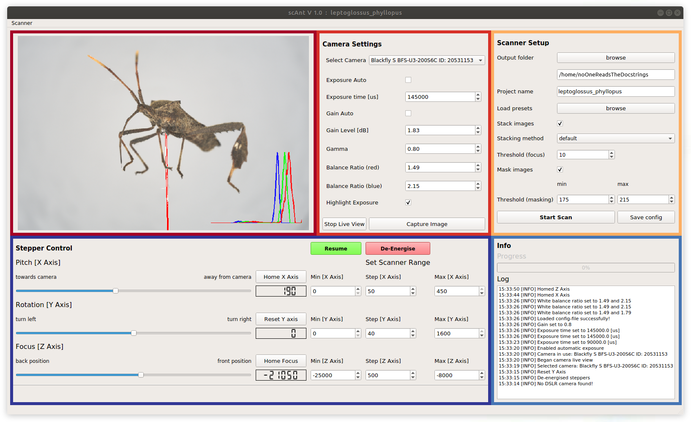

# scAnt - Open Source 3D Scanner

**scAnt** is an open-source, low-cost macro 3D scanner, designed to automate the creation of digital 3D models of insects of various sizes in full colour. **scAnt** provides example configurations for the scanning process, as well as scripts for stacking and masking of images to prepare them for the photogrammetry software of your choice. Some examples of models generated with **scAnt** can be found on http://bit.ly/ScAnt-3D as well as on our [Sketchfab Collection](https://sketchfab.com/EvoBiomech/collections/scant-collection)!


All structural components of the scanner can be manufactured using 3D-printing and laser cutting; the required files are available for download in .ipt, .iam, .stl, and .svg format on our [thingiverse](https://www.thingiverse.com/fabianplum/designs) page.


## Updates
- **scAnt 1.1** now supports the use of **DSLR** cameras on **Windows 10**, in combination with [DigiCamControl](http://digicamcontrol.com/). Please refer to the [official documentation](http://digicamcontrol.com/cameras) to check whether your camera model is currently supported. **Ubuntu** support will be added soon. An updated version of the scanner construction files will be made available on our [Thingiverse](https://www.thingiverse.com/thing:4694713) page.  


## Installation
**scAnt** is supported by 64 bit versions of **Windows 10** and **Ubuntu 18.04** (newer releases of Ubuntu will likely work but have not been tested). The pipeline and GUI have been designed specifically for use with [FLIR Blackfly](https://www.flir.co.uk/products/blackfly-s-usb3/) cameras, and [Pololu USB Stepper drivers](https://www.pololu.com/category/212/tic-stepper-motor-controllers). We have now added support for **DSLR** cameras for **Windows** operating systems as well. Please refer to our [Thingiverse](https://www.thingiverse.com/thing:4694713) page for a full list of components.

The easiest way to get your scanner up and running is through installation of our pre-configured anaconda environment:

**for Ubuntu 18.04**

```bash
cd conda_environment
conda env create -f scAnt_UBUNTU.yml
```

**for Windows 10**

```bash
cd conda_environment
conda env create -f scAnt_WINDOWS.yml
```

After the environment has been created successfully, re-start the terminal, and run the following line to activate the environment, and to continue the installation.

 ```bash
conda activate scAnt
```

If you do not wish to install the pre-configured environment, here are the dependencies:

  - python >= 3.6
  - pip
  - numpy
  - matplotlib
  - opencv >= 4.1.0
  - pyqt 5
  - imutils
  - pillow
  - scikit-image


Additional drivers and libraries for the camera and stepper drivers need to be installed, as described for both Ubuntu and Windows below.
***

### Ubuntu 18.04

Download the drivers and python bindings for **Spinnaker & Pyspin** from the official FLIR page:

[meta.box.lenovo.com](https://meta.box.lenovo.com/v/link/view/a1995795ffba47dbbe45771477319cc3)


**FLIR Support / Spinnaker / Linux Ubuntu / Ubuntu 18.04**

*download the tar.gz file for your architecture (usually amd64)*

**FLIR Support / Spinnaker / Linux Ubuntu / Python / Ubuntu 18.04 / x64**

*depending on your python version, download the respective file. For our conda environment download **...cp37-cp37m_linux_x86_64.tar.gz***


Unpack all files in a folder of your choice. Then proceed with the following steps:

1. Install all required dependencies

```bash
sudo apt-get install libavcodec57 libavformat57 libswscale4 libswresample2 libavutil55 libusb-1.0-0 libgtkmm-2.4-dev
```

2. Install spinnaker from its extracted folder. During installation, ensure to add your user to the user-group and accept increasing allocated USB-FS memory size to 1000 MB in order to increase the video stream buffer size

```bash
sudo sh install_spinnaker.sh
```

3. **Reboot** your computer

4. Launch spinview and connect your FLIR camera to verify your installation (if the application is already launched when plugging in your camera, refresh the list)

5. Next, install the downloaded **.whl** file for your python environment. Ensure you activate your python environment before running the **pip install** command below.

```bash
pip install spinnaker_python-1.x.x.x-cp37-cp37m-linux_x86_64.whl
```

6. To verify everything has been installed correctly, run **Live_view_FLIR.py** from the GUI folder. 

```bash
cd scant/GUI
python Live_view_FLIR.py
```

If a live preview of the camera appears for a few seconds and an example image is saved (within the GUI folder), all camera drivers and libraries have been installed correctly.

**Stepper driver setup**

1. The Pololu stepper drivers can be controlled and set up via a console. Download the drivers specific to your system from [pololu.com](https://www.pololu.com/docs/0J71/3.2), which also provides additional information regarding installation and a list of supported commands. All drivers are open-source, and the respective code can be found on [Pololu's Git](https://github.com/pololu/pololu-tic-software).

2. Unpack the downloaded .tar.xy file and install the driver:

```bash
sudo pololu-tic-*/install.sh
```

3. Next, **reboot** your computer to update your user privileges automatically, otherwise you will have to use **sudo** to access your USB stepper drivers.

4. If one or all of the stepper controllers were previously plugged into your computer re-plug them, so they are recognised correctly by your computer. Now, open the terminal and run:

```bash
ticcmd --list
```

This should output a list of all connected USB stepper drivers.

6. To test which ID corresponds to which stepper, launch the **Tic Control Center** application and move the sliders. You can use this application to test each motor and set up turning speeds and assign pins for the connected endstops. From **/scripts**, open the **Scanner_Controller.py** script in an editor of choice and add the **IDs** of each the stepper to the corresponding axes:

```python
self.stepperX_ID = "XXXXXXXX"
self.stepperY_ID = "YYYYYYYY"
self.stepperZ_ID = "ZZZZZZZZ"
```

7. Now that your camera and steppers are all set up, you can run a complete functionality check of the scanner by running the **Scanner_Controller.py** script.

```bash
cd scAnt/scripts
python Scanner_Controller.py
```
- the scanner will then home all axes, drive to a set of example positions and capture images as it would during scanning for a very coarse grid.
- If no errors appear, images will be saved and “Demo completed successfully” is printed to the console

**Image Processing**

A number of open source tools are used for processing the RAW images captured by the scanner. For a detailed explanation of each, refer to the official [hugin](http://hugin.sourceforge.net/docs/) and [exiftool](https://exiftool.org/) documentation. The following lines will install _all_ the good stuff:

```bash
sudo add-apt-repository ppa:hugin/hugin-builds
sudo apt-get update
sudo apt-get install hugin enblend
sudo apt install hugin-tools
sudo apt install enfuse
sudo apt install libimage-exiftool-perl
```

***

### Windows 10

(Instructions for using **DSLR** cameras in the section below. You can skip the **FLIR** installation section, if you are not planning on using **FLIR** cameras.) 
Download the drivers and python bindings for **Spinnaker & Pyspin** from the official FLIR page:

[meta.box.lenovo.com](https://meta.box.lenovo.com/v/link/view/a1995795ffba47dbbe45771477319cc3)


**FLIR Support / Spinnaker / Windows**

*download the SpinnakerSDK_FULL_x.x.x.x_x64.exe file for your architecture (usually x64)*

**FLIR Support / Spinnaker / Windows / python**

*depending on your python version, download the respective file. For our conda environment download **...cp37-cp37m_linux_x86_64.tar.gz***


Unpack all files in a folder of your choice. Then proceed with the following steps:

1. Install the SpinnakerSDK...exe:
* choose **Application Development** in the installation profile.
* if you have **not** installed Visual Studio, choose the latest version shown in the installer and the recommeneded packages
* select "I will use GigE cameras" if applicable (we use a USB 3.0 version of the FLIR BFS) 
* no need to participate in any evaluation programs if you don't want to

2. Next, install the downloaded **.whl** file for your python environment. Ensure you activate your python environment before running the **pip install** command below. Ensure your python environment is active.

```bash
pip install spinnaker_python-x.x.x.x-cpX-cpXm-win_amd64.whl
```

3. To verify everything has been installed correctly, run **Live_view_FLIR.py** from the GUI folder. 

```bash
cd scant/GUI
python Live_view_FLIR.py
```

If a live preview of the camera appears for a few seconds and an example image is saved (within the GUI folder), all camera drivers and libraries have been installed correctly.


**DSLR setup**

To use scAnt with DSLR cameras, instead of FLIR machine vision cameras, you need to install [DigiCamControl](http://digicamcontrol.com/) from the following website:

[digiCamControl Stable Version](http://digicamcontrol.com/download)

Follow the installation instructions and note the **installation path**. By default the path should be:

```bash
'C:Program Files (x86)/digiCamControl'
```

If your installation **path is different**, you will need to add the updated folder path to **GUI/Live_view_DSLR.py**

```python
# Update with the path to CameraControlCmd.exe file.
digi_cam_path = join('C:' + sep, 'Program Files (x86)', 'digiCamControl')
```

To check whether the installation and setup was successful, connect your DSLR camera to the computer (must be in MANUAL mode) and run the following commands:

```bash
conda activate scAnt
cd GUI
python Live_view_DSLR.py
```

The script will launch an instance of **digiCamControl**, read the current camera settings, and capture three images at different ISO values.


**Stepper driver setup**

1. The Pololu stepper drivers can be controlled and set up via a console. Download the drivers specific to your system from [pololu.com](https://www.pololu.com/docs/0J71/3.1), which also provides additional information regarding installation and a list of supported commands. All drivers are open-source, and the respective code can be found on [Pololu's Git](https://github.com/pololu/pololu-tic-software).

2. Unpack the downloaded pololu-tic-x.x.x-win.msi file and install the driver:
* double click the file to start the installation
* check "Add the bin directory to the **PATH environment variable**"

3. If one or all of the stepper controllers were previously plugged into your computer re-plug them, so they are recognised correctly by your computer. Now, open the terminal and run:

```bash
ticcmd --list
```

This should output a list of all connected USB stepper drivers.

4. To test which ID corresponds to which stepper, launch the **Tic Control Center** application and move the sliders. You can use this application to test each motor and set up turning speeds and assign pins for the connected endstops. From **/scripts**, open the **Scanner_Controller.py** script in an editor of choice and add the **IDs** of each the stepper to the corresponding axes:

```python
self.stepperX_ID = "XXXXXXXX"
self.stepperY_ID = "YYYYYYYY"
self.stepperZ_ID = "ZZZZZZZZ"
```

5. Now that your camera and steppers are all set up, you can run a complete functionality check of the scanner by running the **Scanner_Controller.py** script.

```bash
cd scAnt/scripts
python Scanner_Controller.py
```
- the scanner will then home all axes, drive to a set of example positions and capture images as it would during scanning for a very coarse grid.
- If no errors appear, images will be saved and “Demo completed successfully” is printed to the console


**Image Processing**

A number of open source tools are used for processing the RAW images captured by the scanner. For a detailed explanation of each access to their source code, refer to the official [hugin](http://hugin.sourceforge.net/docs/) and [exiftool](https://exiftool.org/) documentation. For windows, we provide a set of precombpiled executable files of the required applications in **/external**.

***

## Quick Start Guide

After the installation, the scanner hardware and connected camera can be fully controlled via the scAnt GUI. While there is no right or wrong order to configure each component and your workflow might depend on your exact hardware, we generally set up the scanner in 3 steps: **(1) Configuring the camera**, **(2) configuring the stepper motors**, and **(3) Configuring the scanning process** saving the project as well as starting the scan.



**Configuring the Camera**

From the first box in the Camera Settings box, **select your connected camera**. Depending on which type of camera model you have connected, you will be able to access different setting options. For FLIR Blackfly cameras, the options include:

* **Exposure auto** – Automatically chooses exposure time for you. Useful for finding initial values but needs to be disabled for the scanning process
* **Exposure time [us]** – The total time to capture an entire scan scales linearly with the exposure time chosen here. However, as we want to minimise the gain level for as little noise as possible, quality should be chosen over speed.  
* **Gain auto** – Similarly to Exposure auto, this option should only be used for the initial setup and not during scanning.
* **Gain Level** – influences the brightness of the image by setting the image sensor's sensitivity higher or lower. Lower levels are generally preferred to reduce image noise.
* **Gamma** – Applies contrast correction, affecting primarily mid-tones.
* **Balance Ratio (Red/Blue)** – used to adjust the white balance of the image
* **Highlight Exposure** – Highlights overexposed regions of the live view image in red and displays normalised colour curves in the bottom right corner.
* **Start / Stop Live View** – displays the current video feed of the connected camera (when using DSLR cameras, an instance of DigiCamControl will be opened in an external window, and the camera live view is displayed there)
* **Capture image** – An image will be captured with the current settings and saved to the output folder specified in the **Scanner Setup section**.

1. Before picking your settings, you should first move the camera to a position where the specimen within the scanner is in focus and occupies as much of the image as possible without coming in contact with the image borders. In the **Stepper Controller** section, you will first have to click "**Home X-Axis**" and "**Home Z-Axis**", which returns the motors to their 0 positions. Afterwards, set the **X-Axis** to **190**, which moves the gimbal arm's pitch perpendicular to the ground. The position of the camera will depend on the used camera type and model. In our case, a value of ~ **-20000** will bring the specimen (partially) into focus. 

2. Turn on "**Start Live View**" and "**Highlight Exposure**" to display overexposed areas (red) and normalised colour curves on top of the live view image. 

3. Increase the **exposure/gain** until the image is evenly exposed. Ensure no parts of the specimen are highlighted in red, as these overexposed areas will result in loss of information. An overexposed mounting pin does, however, not pose an issue. 

4. Correct the white balance of the image by adjusting the red and blue **Balance Ratio**, respectively. You can use the colour curves displayed in the **Live View** as a rough guide by aligning the blue and red curves with the green curve, as the neutrally grey background makes up the largest number of image pixels. If you cannot find suitable settings or the specimen appears discoloured, remove it from the illumination chamber, and calibrate the white balance only based on the background. For a finer colour calibration and correction, refer to the official [OpenCV documentation](https://docs.opencv.org/master/d1/dc1/tutorial_ccm_color_correction_model.html) or your camera's manufacturer.

**Configuring the Stepper Motors**

The most critical parameters that need to be configured for the scan are the step sizes for each axis and the Min **[Z axis]** and Max **[Z axis]** values. 

1. We have achieved our best results by leaving the Step **[X Axis]** and **50** and the Step **[Y axis]** at **40**. While finer resolutions are possible, we haven't observed notable changes in mesh quality when increasing the resolution (by decreasing the step size) much further. The **Max [X Axis]** and **Max [Y Axis]** should be left unchanged unless the scanner is supposed to be used as a stacking rail only, in which case both values should be equivalent to their respective **Min** value.
2. The  **Step [Z Axis]** should be determined by your chosen lens and aperture's depth of field. As a rule of thumb, the step size should be equivalent to roughly half the field's depth to achieve adequate overlap of in-focus areas during image stacking.
3. The **Min [Z axis]** and **Max [Z axis]** values should be chosen based on the size of the scanned specimen, where the **Min [Z axis]** allows the nearest part and the **Max [Z axis]** the farthest part to be in focus. 

**ATTENTION**: It may be that these positions change depending on the **X** and **Y-axis** positions, so move both (by using the **sliders** of the respective axis) to find these points. Images that are not in focus can be removed automatically, but **if a part is never in focus** in specific orientations during the scan, it will be **poorly reconstructed**.

**Configuring the Scanning Process**

1. Choose an **Output Folder** location by clicking the browse button in the **Scanner Setup** section.
2. Pick an easily identifiable name for your project, such as the species of your scanned specimen. When capturing an image, saving your configuration, or starting a scan, the GUI will generate a folder with your project name in the output folder you have chosen.
3. Next, configure which processing steps you want to execute in parallel with the scan. The number of threads run in the background will be automatically determined based on the number of (virtual) threads your computer suppports.

[OPTIONAL]

All processing functions, including removing out of focus images, generating Extended Depth Of Field (EDOF) images, and generating alpha masks, can be run while capturing images or as standalone scripts (scAnt/scripts). The default values shown in the GUI generally work well for most specimens with our setup. However, the following adjustments may aid in achieving the best quality for yours:

4. Enabling **Stack images** will lead to scAnt automatically processing the captured files to EDOF images. The default stacking method produces mostly excellent results. However, if halos around the specimen's outlines in the resulting EDOF image are prominent, *1-star* may provide better results. The **Threshold (focus)** is a scalar value representing the Laplacian variance of each image required for it to be considered *"sharp enough for stacking"*. Simply put, this is used to discard images that appear entirely out of focus. This parameter is sensitive to image noise, resolution, and specimen size. Pay close attention to the messages **printed in the console** regarding removed images. To anticipate the results better, you can use the standalone script **(scripts/focus_stacker.py)** to display the process.

5. Enabling **Mask Images** will generate an alpha mask for each stacked EDOF image. While the outline is extracted using a pretrained [random forest](https://docs.opencv.org/3.1.0/d0/da5/tutorial_ximgproc_prediction.html), the infill is removed using a simple adaptive thresholding step where pixels of a specific brightness are removed from the mask, before being cleaned up using [connected component labelling]( https://aishack.in/tutorials/connected-component-labelling/). The upper and lower bounds of the threshold need to be defined here. The easiest way to find suitable values is to capture an image of your specimen (in the Camera Settings section, click on **Capture image**) and open it in an image editor of your choice (*e.g. GIMP, MS Paint, Photoshop*). Use the **colour picker tool** to return the RGB value from various background locations, ideally close to the specimen. Note the lowest and highest values out of all channels and fill them into the respective box. Again, you can use its standalone script (**/scripts/mask_generator**) to verify your tests before conducting a full scan. We are planning on implementing a function to determine these parameters automatically soon.

6. Once everything is set up to your liking, hit **Start Scan**, and grab a cup of coffee/tea/beer, depending on the time of day.

**Happy Scanning!**


***
## Meshroom Guide

**Add your camera to the sensor database**

Within the directory of the downloaded Meshroom installation, go to the following folder and edit the file “**cameraSensors.db**” using any common text editor:

*…/Meshroom-2019.2.0/AliceVision/share/AliceVision/cameraSensors.db*

The entry should contain the following:

```bash
Make;Model;SensorWidth
```
Ensure to enter these details as they are listed in your project configuration file, thus, metadata of your stacked and masked images. There should be no spaces between the entries. If you are using the same FLIR camera as in the original **scAnt**, add the following line:

```bash
FLIR;BFS-U3-200S6C-C;13.1
```
Adding the correct sensor width is crucial in computing the camera intrinsics, such as distortion parameters, object scale, and distances. Otherwise the camera alignment, during feature matching and structure-from-motion steps are likely to fail.

Once these details have been added, launch **Meshroom** and drag your images named *…cutout.tif* into **Meshroom**. If the metadata and added camera sensor are recognised, a **green aperture icon** should be displayed over all images.


If not all images are listed, or the aperture icon remains red / yellow, execute the helper script “batch_fix_meta_data.py” to fix any issues resulting from your images' exif files. 

**Setting up the reconstruction pipeline**

*Try to run the pipeline with this configuration, before attempting to use approximated camera positions. Approximate positions should only be used if issues with the alignment of multiple camera poses arise, as fine differences in the scanner setup can cause poorer reconstruction results, without **guided matching** (available only in the **2020 version** of **Meshroom**)!*

1. **CameraInit**

- *No parameters need to be changed here.*
- However, ensure that only one element is listed under **Intrinsics**. If there is more than one, remove all images you imported previously, delete all elements listed under **Intrinsics**, and load your images again. If the issue persists, execute the helper script “batch_fix_meta_data.py” to fix any issues resulting from your images exif files. 

2. **FeatureExtraction**

- Enable Advanced Attributes** by clicking on the three dots at the upper right corner.
- Describer Types: Check **sift** and **akaze**
- Describer Preset: Normal (pick High if your subject has many fine structures)
- Force CPU Extraction: Uncheck

3. **ImageMatching**

- Max Descriptors: 10000
- Nb Matches: 200

4. **FeatureMatching**

- Describer Types: Check **sift** and **akaze**
- Guided Matching: Check

5. **StructureFromMotion**

- Describer Types: Check **sift** and **akaze**
- Local Bundle Adjustment: Check
- Maximum Number of Matches: 0 (ensures all matches are retained)

6. **PrepareDenseScene**

- *No parameters need to be changed here.*

7. **DepthMap**

- Downscale: 1 (use maximum resolution of each image to compute depth maps)

8. **DepthMapFilter**

- Min View Angle: 1
- Compute Normal Maps: Check

9. **Meshing**

- Estimate Space from SfM: Uncheck (while this will potentially produce “floaters” that need to be removed during post processing it assists in reserving very fine / long structures, such as antennae)
- Min Observations for SfM Space Estimation: 2 (only required if above attribute remains checked)
- Min Observations Angle for SfM Space Estimation: 5 (only required if above attribute remains checked)
- Max Input Points: 100000000
- simGaussianSizeInit: 5
- simGaussianSize: 5
- Add landmarks to the Dense Point Cloud: Check	

10. **MeshFiltering**

- Filter Large Triangles Factor: 40
- Smoothing Iterations: 2

11. Texturing

- Texture Side: 16384
- Unwrap Method: **LSCM** (will lead to larger texture files, but much higher surface quality)
- Texture File Type: png
- Fill Holes: Check

Now click on **start** and watch the magic happen. Actually, this is the best time to grab a cup of coffee, as the reconstruction process takes between 3 and 10 hours, depending on your step size, camera resolution, and system specs.

**Exporting the textured mesh:**

All outputs within Meshroom are automatically saved in the project’s environment. By right clicking on the **Texturing node** and choosing “**Open Folder**” the location of the created mesh (**.obj** file) is shown.


***

## Contributing
Pull requests are welcome. For major changes, please open an issue first to discuss what you would like to change.

Please make sure to update tests as appropriate.

## License
**scAnt** - Open Source 3D Scanner and Processing Pipeline

© Fabian Plum, 2020
[MIT License](https://choosealicense.com/licenses/mit/)
